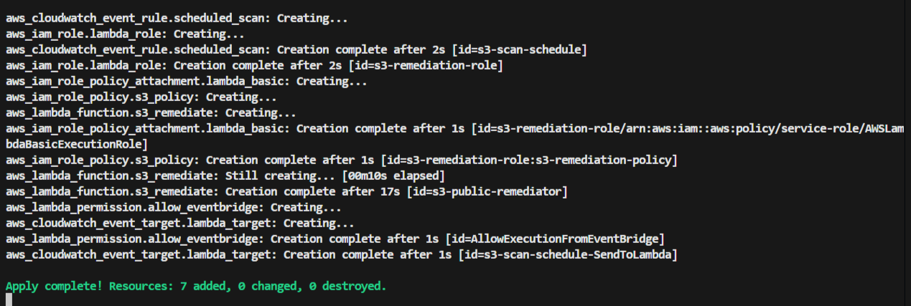

# 🛡️ AWS S3 Public Access Auto-Remediation

**Keeping S3 buckets private, automatically.** This project is all about "self-healing" infrastructure. I built a system that keeps a constant eye on an AWS account and instantly flips the "Public Access Block" switches back to **ON** if they ever get turned off.

---

## 🗺️ Project Overview

In a real-world cloud setup, one misclicked button can make a bucket public and leak sensitive data. I wanted to solve this without having to manually check settings every day. 

Using **Terraform** and some **Python logic**, I created an automated system that acts like a security guard—scanning the account every 5 minutes and fixing any open buckets it finds.

## ☁️ How it Works

The setup is pretty straightforward and uses a few key AWS services:

* **Amazon EventBridge:** The "alarm clock" that triggers the check every 5 minutes.
* **AWS Lambda:** The "brain" that runs a Python script to scan all buckets.
* **Boto3 SDK:** How the script talks to the S3 API to check and fix settings.
* **CloudWatch:** Where I keep the logs so I can see exactly what got fixed and when.

## ⚙️ Infrastructure (The Terraform Bit)

I didn't want to click around the AWS Console to set this up, so everything is defined in Terraform. This makes it super easy to deploy the whole stack into any region in a couple of minutes.

*Terraform getting everything ready.*

---

## ✅ Proof it Works

I ran a quick stress test to make sure the automation was actually doing its job.

### 1. The "Oops" Moment (Before)
I manually went into a test bucket and disabled the Public Access Block. Not a good look for security!

### 2. The Fix (Logs)
I waited a few minutes, and sure enough, the Lambda function woke up, saw the problem, and fixed it.

*The logs showing the script finding the open bucket and locking it down.*

### 3. All Secure (After)
Checking the bucket again—it's back to being fully private. 

---

## 🔐 Permissions (Least Privilege)
The Lambda function doesn't need "Admin" powers. I gave it just enough access to:
* List the buckets in the account.
* See the current public access settings.
* Update those settings if they're wrong.

---

## 📈 What I Learned

* **Cloud Security:** How to move from just "monitoring" to "auto-remediation."
* **IaC:** Deepening my Terraform skills by managing serverless triggers and IAM roles.
* **Automation:** Using Python/Boto3 to handle repetitive security tasks.
* **Troubleshooting:** Reading CloudWatch logs to verify that my logic actually works in the real world.

---
